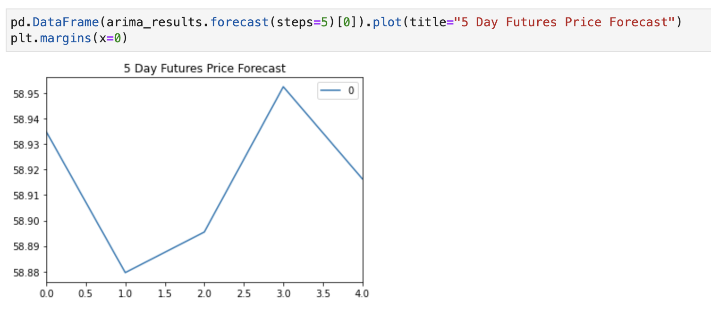
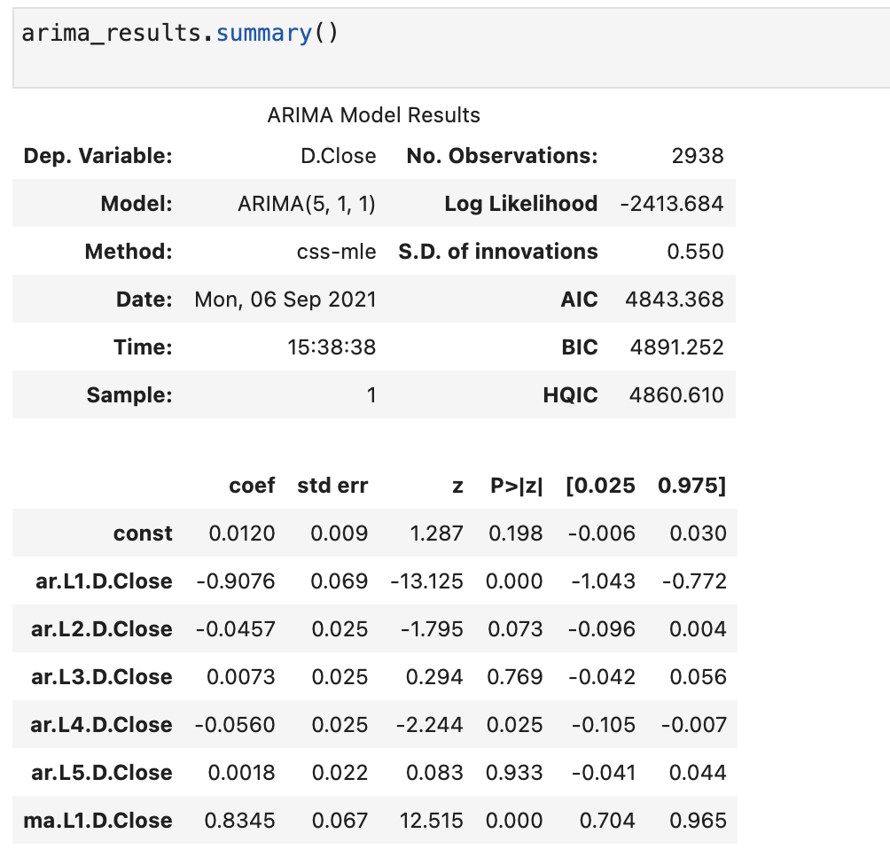
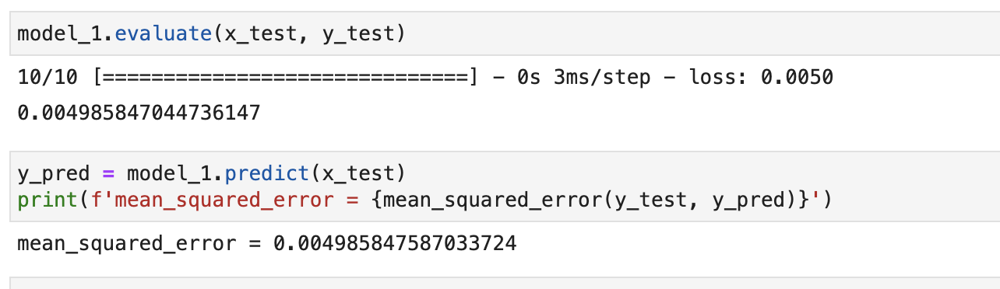
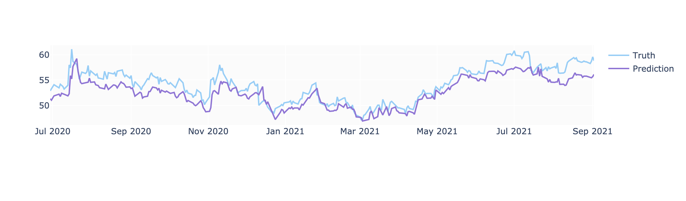

# An attempt to predict the future: coding machine learning and AI models to predict pharmaceutical company stocks.

The main objective of this project is to code machine learning and AI models in an attempt to predict future closing prices for stocks. Under the understanding that this is a challenging and subjective task, our main goal is to get as close as possible to a good model to use in real life investing. 

Additionally, in light of current world's relevant events, we selected the main pharmaceutical companies which are leading the market in developping COVID vaccines. Pfizer, Moderna, Johnson & Johnson and Astrazeneca; each of these companies have a different history and period for when they went public in the market, this was also an important point of consideration for this project.

All of the DATA analyzed was fetched from Yahoo Finance, and all of the different models ran for this project used the same source of information/data set-up.

```python:
start = dt.datetime(2010,1,1)
end = dt.datetime.now()
tickers = ['PFE', 'MRNA', 'JNJ', 'AZN']

filenames = []

for ticker in tickers:
    if ticker == 'MRNA':
        df = yf.download(ticker, dt.datetime(2018,12,7), end)
    else:
        df = yf.download(ticker, start, end)
    filename = f'{ticker}_stock_prices.csv'
    filenames.append(filename)
    df.to_csv(filename)
    
for filename in filenames:
    if filename.startswith('AZN'):
        azn_df = pd.read_csv('AZN_stock_prices.csv', index_col='Date', parse_dates=True)
    elif filename.startswith('MRNA'):
        mrna_df = pd.read_csv('MRNA_stock_prices.csv', index_col='Date', parse_dates=True)
    elif filename.startswith('JNJ'):
        jnj_df = pd.read_csv('JNJ_stock_prices.csv', index_col='Date', parse_dates=True)
    else:
        pfe_df = pd.read_csv('PFE_stock_prices.csv', index_col='Date', parse_dates=True)
```
-----------------

## Link to models studied and coded:

### ARMA & ARIMA - Machine Learning - Time Series Analysis


[ARIMA](https://github.com/yandomingos/project-2/blob/main/ARIMA.ipynb)

[ARMA]

### LSTM & XGBRegressor

[MAIN NOTEBOOK: code and findings - ASTRAZENECA](https://github.com/yandomingos/project_2_predicting_stock_prices/blob/main/MAIN_NOTEBOOK_LSTM_AZT.ipynb)

[PFIZER - PFE](https://github.com/yandomingos/project_2_predicting_stock_prices/blob/main/LSTM_XGBRegressor_PFE.ipynb)

[JOHNSON & JOHNSON - JNJ](https://github.com/yandomingos/project_2_predicting_stock_prices/blob/main/LSTM_JNJ.ipynb)

[MODERNA - MRNA](https://github.com/yandomingos/project_2_predicting_stock_prices/blob/main/LSTM_XGBRegressor_MRNA.ipynb)

## Summary of results and findings:

ARMA & ARIMA: Both the ARMA and the ARIMA model have p-values that are higher than .05 , and therefore, the coefficient for the autoregressive term is not significant and should not be kept in the models. The models are a great start point for the analysis, however, we believe that more key indicators should be added to the analysis as we're trying to get as close as possible to true prediction. As a result, we did not select neither as good models to move forward.

#### ARIMA RESULTS






XGBRegressor:

LSTM - Long Short-Term Memory: we found this model to be the most trainable and resistant to noise. We added the following key indicators: Simple moving average, exponential moving average, moving average convergence and relative strenght index (RSI).
In order to select this model as the most successful, we trained the model in different ways feeding it different data from different periods in time. 






